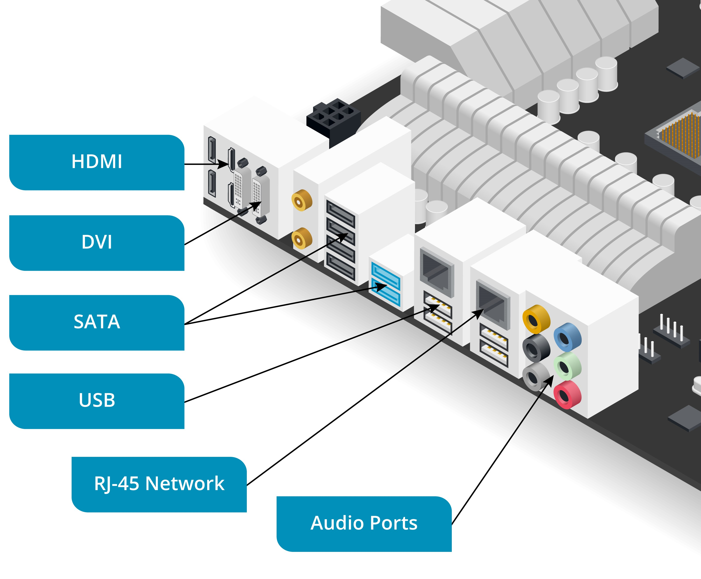
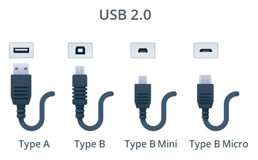
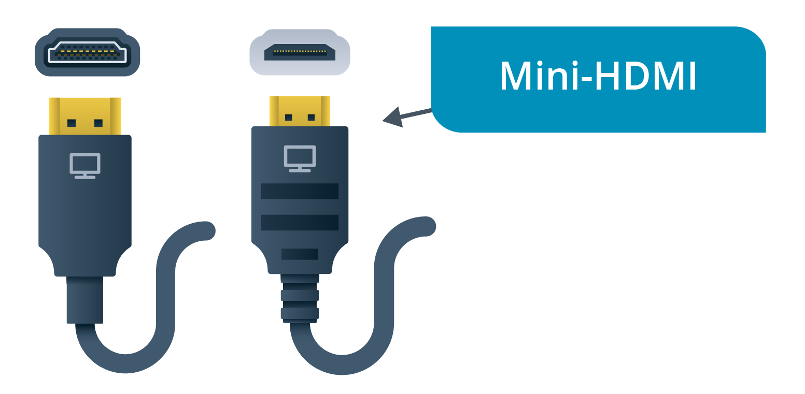
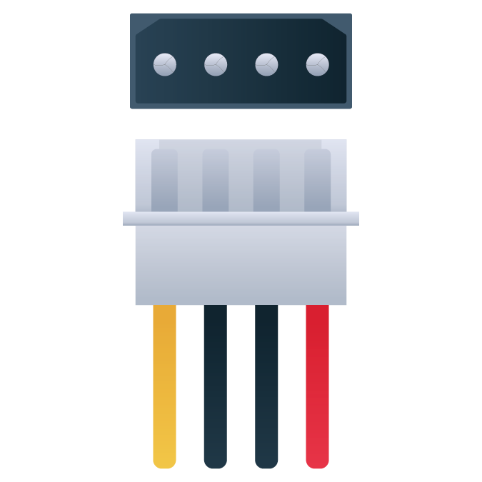

Topic 1A

Explain Cable Types and Connectors

CORE 1 EXAM OBJECTIVES COVERED

<figure>

3.1 Explain basic cable types and their connectors, features, and purposes.

</figure>

A PC is made up of many different components. All these components need to be able to communicate with each other so that the computer can function properly. If you can distinguish connection interfaces and connectors quickly, you will be able to support users by installing, upgrading, and replacing PC peripherals efficiently.

    

        

            

                    
Personal Computers

                

        

    

    

        

            

                
The components of a personal computer (PC) are divided between those that are designed to be
                    handled by the user—peripheral devices—and those that would be damaged or dangerous if exposed.
                    Peripheral devices typically perform the function of input (keyboard, mouse, microphone, and
                    camera), output (monitor and speakers), or external storage.

                
The system case/chassis houses the internal components. These include the motherboard, central
                    processing unit (CPU), system memory modules, adapter cards, fixed disks, and power supply unit.
                    Most cases use a tower form factor that is designed to be oriented vertically and can be placed
                    on a desk or on the floor.

            

        

    

    

        

            <figure>
                

                    
PCs can also be purchased as all-in-one
                            units. All-in-one means that the internal components are contained within a case
                        that is also a monitor.

                

            </figure>
        

    

    

        

            

                
To perform PC maintenance, you must understand how to open a desktop computer's case.

                <ul>
                    <li>A tower case has a side cover that can be removed by sliding the panel from its housing.
                        Cases might be secured by screws or retaining clips and might have anti-tamper security
                        mechanisms. Always refer to the system documentation, and follow the recommended steps.</li>
                    <li>The front panel provides access to the removable media drives, a power on/off switch, and
                        light- emitting diodes (LEDs) to indicate drive operation. The front cover can be removed
                        but may require the side panel to be removed first to access the screws or clips that secure
                        it.&nbsp;</li>
                </ul>
                
 

            

        

    

    

        

            <figure>
                

                    
Features on the front of a typical PC case. (Image © 123RF.com)

                

            </figure>
        

    

    

        

            

                
The rear panel provides access to the power supply unit (PSU) sockets. The PSU has an integral
                    fan exhaust. Care should be taken that it is not obstructed, as this will adversely affect
                    cooling. There may be an additional case fan.

            

        

    

    

        

            <figure>
                

                    
Features on the rear panel of a typical PC case. (Image © 123RF.com)

                

            </figure>
        

    

    

        

            

                
Below the PSU, there is a cutout aligned with the motherboard's input/output (I/O) ports. These
                    allow for the connection of peripheral devices.

                
At the bottom of the rear panel there are cutout slots aligned with the position of adapter card
                    slots to allow cables to be connected to any I/O ports on the cards. These slots should either
                    be covered by an adapter card or a metal strip known as a blanking plate. Uncovered slots can
                    disrupt the proper flow of air around components in the PC and cause overheating and increase
                    the amount of dust in the system.

            

        

    

    

        

            

                    
Peripheral Devices

                

        

    

    

        

            

                
An input/output (I/O) port allows a device to be connected to the PC via a <strong>peripheral
                        cable</strong>. Some ports are designed for a particular type of device, such as a graphics
                    port to connect a monitor. Other ports support a variety of device types. External ports are
                    positioned at the rear or front of the PC through cutouts  in the case. They can be
                    provided on the motherboard or as an expansion card.

            

        

    

    

        

            <figure>
                

                    
I/O ports on a motherboard. (Image © 123RF.com)

                

            </figure>
        

    

    <h3 class="gt-block gt-heading b-h3 ps-h3-undefined h3" data-id="88bc0903-d4b3-40a0-bfdc-226fe0149090"
        id="88bc0903-d4b3-40a0-bfdc-226fe0149090">
        

                
Interfaces, Ports, and Connectors

            

    </h3>
    

        

            

                
A hardware port is the external connection point for a particular type of bus interface. A bus
                    allows the transfer of data to and from devices. The connector is the part of a peripheral cable
                    that can be inserted into a port with the same shape or form factor. Each bus interface type
                    might use multiple connector form factors. Most connectors and ports now use edge contacts and
                    either have an asymmetric design called <em>keying</em> to prevent them from being inserted the
                    wrong way around or are reversible.

            

        

    

    

        

            <figure>
                

                    
A peripheral cable for the Universal Serial Bus (USB) interface with different connector
                        types being used to connect a portable hard drive and a desktop computer. (Image ©
                        123RF.com)

                

            </figure>
        

    

    <h3 class="gt-block gt-heading b-h3 ps-h3-undefined h3" data-id="13e7fe1a-8b54-46da-bb8f-39c47f18fc1f"
        id="13e7fe1a-8b54-46da-bb8f-39c47f18fc1f">
        

                
Binary Data Storage and Transfer Units

            

    </h3>
    

        

            

                
When comparing bus interfaces, it is important to use appropriate units. Computers process binary
                    data. Each binary digit or bit (b) can have the value one or zero. Storage is often measured in
                    multiples of eight bits, referred to as a byte (B). A lowercase “b” unit refers to a bit, while
                    uppercase means a byte.

                
Transfer rates are expressed in units per second of the following multiples of bits and bytes:
                

                <ul>
                    <li>1000—Kilobits (Kb/s or Kbps) and kilobytes (KB/s and KBps).</li>
                    <li>1000x1000—Megabits (Mb/s) or megabytes (MB/s).</li>
                    <li>1000x1000x1000—Gigabits (Gb/s) and gigabytes (GB/s).</li>
                </ul>
                
 

            

        

    

    

        

            

                    
Universal Serial Bus Cables

                

        

    

    

        

            

                
The Universal Serial Bus (USB) is the standard means of connecting most types of peripheral
                    device to a computer. USB peripheral device functions are divided into classes, such as human
                    interface (keyboards and mice), mass storage (disk drives), printer, audio device, and so on.
                

                
A USB is managed by a host controller. Each host controller supports multiple ports attached to
                    the same bus. In theory, there could be up to 127 connected devices per controller, but to
                    overcome the limitations of sharing bandwidth, most PC motherboards provision multiple USB
                    controllers, each of which has three or four ports.

            

        

    

    

        

            <figure>
                

                    
USB port symbol. Variations on this basic icon identify supported features, such as higher
                        transfer rates and power delivery. Wikimedia Commons (<a
                            href="https://commons.wikimedia.org/wiki/File:USB_icon.png"
                            target="_blank">commons.wikimedia.org/wiki/File:USB_icon.png</a>)

                

            </figure>
        

    

    <h3 class="gt-block gt-heading b-h3 ps-h3-undefined h3" data-id="73f97972-7627-402b-991f-a3d4e5335cc3"
        id="73f97972-7627-402b-991f-a3d4e5335cc3">
        

                
USB Standards

            

    </h3>
    

        

            

                
There have been several iterations of the USB standard. Each version introduces better data
                    rates. A version update may also define new connector form factors and other improvements. The
                    <strong>USB 2.0</strong> HighSpeed standard specifies a data rate of 480 Mbps shared between all
                    devices attached to the same host controller. The bus is half-duplex, meaning that each device
                    can send or receive, but not at the same time.

                
Iterations of USB 3.x introduced new connector form factors and upgraded transfer rates, each of
                    which are full-duplex, so a device can send and receive simultaneously. USB 3.2 deprecated some
                    of the older terms used to describe the supported transfer rate:

            

        

    

    

        

            <figure>
                <table class="gt-table e-table-default">
                    <colgroup>
                        <col width="25%">
                        <col width="25%">
                        <col width="25%">
                        <col width="25%">
                    </colgroup>
                    <thead>
                        <tr>
                            <th colspan="1" rowspan="1" class="vertical-align-middle">
                                
Standard

                            </th>
                            <th colspan="1" rowspan="1" class="vertical-align-middle">
                                
Speed

                            </th>
                            <th colspan="1" rowspan="1" class="vertical-align-middle">
                                
Connectors

                            </th>
                            <th colspan="1" rowspan="1" class="vertical-align-middle">
                                
Legacy Designation

                            </th>
                        </tr>
                    </thead>
                    <tbody>
                        <tr>
                            <td colspan="1" rowspan="1" class="vertical-align-middle">
                                
USB 3.2 Gen 1 SuperSpeed USB

                            </td>
                            <td colspan="1" rowspan="1" class="vertical-align-middle">
                                
5 Gbps

                            </td>
                            <td colspan="1" rowspan="1" class="vertical-align-middle">
                                
USB-A, USB-C, USB Micro

                            </td>
                            <td colspan="1" rowspan="1" class="vertical-align-middle">
                                
USB 3.0

                            </td>
                        </tr>
                        <tr>
                            <td colspan="1" rowspan="1" class="vertical-align-middle">
                                
USB 3.2 Gen 2x1 SuperSpeed USB 

                                
10 Gbps

                            </td>
                            <td colspan="1" rowspan="1" class="vertical-align-middle">
                                
10 Gbps

                            </td>
                            <td colspan="1" rowspan="1" class="vertical-align-middle">
                                
USB-A, USB-C, USB Micro

                            </td>
                            <td colspan="1" rowspan="1" class="vertical-align-middle">
                                
USB 3.1

                                
SuperSpeed+

                            </td>
                        </tr>
                        <tr>
                            <td colspan="1" rowspan="1" class="vertical-align-middle">
                                
USB 3.2 Gen 2x2 SuperSpeed USB 

                                
20 Gbps

                            </td>
                            <td colspan="1" rowspan="1" class="vertical-align-middle">
                                
2 x 10 Gbps

                            </td>
                            <td colspan="1" rowspan="1" class="vertical-align-middle">
                                
USB-C

                            </td>
                            <td colspan="1" rowspan="1" class="vertical-align-middle">
                                
 

                            </td>
                        </tr>
                    </tbody>
                </table>
            </figure>
        

    

    

        

            <figure>
                

                    
USB 3 controllers feature two sub-controllers. One controller handles SuperSpeed-capable
                        devices, while the other supports legacy HighSpeed, FullSpeed, and LowSpeed USB v1.1 and
                        v2.0 devices. Consequently, legacy devices will not slow down SuperSpeed-capable devices.
                    

                

            </figure>
        

    

    <h3 class="gt-block gt-heading b-h3 ps-h3-undefined h3" data-id="1b7bebb6-e85f-4b8a-902d-a91d81f9eb71"
        id="1b7bebb6-e85f-4b8a-902d-a91d81f9eb71">
        

                
USB Connector Types

            

    </h3>
    

        

            

                
The connector form factors specified in USB 2 are as follows:

                <ul>
                    <li>Type A—For connection to the host and some types of peripheral device. The connector and
                        port are shaped like flat rectangles. The connector should be inserted with the USB symbol
                        facing up.</li>
                    <li>Type B—For connection to large devices such as printers. The connector and port are square,
                        with a beveled top.</li>
                    <li>Type B <strong>Mini</strong>—A smaller peripheral device connector. This type of connector
                        was seen on early digital cameras but is no longer widely used.</li>
                    <li>Type B <strong>Micro</strong>—An updated connector for smaller devices, such as smartphones
                        and tablets. The micro connector is distinctively flatter than the older mini type of
                        connector.</li>
                </ul>
            

        

    

    

        

            <figure>
                

                    
USB 2 ports and connectors. (Image © 123RF.com)

                

            </figure>
        

    

    

        

            

                
A USB cable can feature Type A to Type A connectors or can convert from one type to another (Type
                    A to Type B or Type A to Micro Type B, for instance).

                
In USB 3, there are new versions of the Type A, Type B, and Type B Micro connectors with
                    additional signaling pins and wires. USB 3 receptacles and connectors often have a blue
                    connector tab or housing to distinguish them. USB 3 Type A connections are physically compatible
                    with USB 1.1 and 2.0 connections, but the Type B/Type B Micro connections are not. So, for
                    example, you could plug a USB 2 Type A cable into a USB 3 Type A port, but you could not plug a
                    USB 3 Type B cable into a USB 2 Type B port.

            

        

    

    

        

            <figure>
                

                    
USB 3 connectors and ports (from left to right): Type A, Type B, Micro Type B, Type C. (Image
                        ©123RF.com)

                

            </figure>
        

    

    

        

            

                
USB 3.1 defines the USB-C connector type. This compact form factor is intended to provide a
                    single, consistent hardware interface for the standard. The connector is reversible, meaning it
                    can be inserted either way up. The connector design is also more robust than the earlier miniB
                    and microB types. USB-C can use the same type of connector at both ends, or you can obtain USB-C
                    to USB Type A or Type B converter cables.

            

        

    

    <h3 class="gt-block gt-heading b-h3 ps-h3-undefined h3" data-id="857abff2-93c2-4466-960f-46f3bacf5c35"
        id="857abff2-93c2-4466-960f-46f3bacf5c35">
        

                
Cable Length

            

    </h3>
    

        

            

                
The maximum cable length for LowSpeed devices is 3 m, while for FullSpeed and HighSpeed the limit
                    is 5 m. Vendors may provide longer cables, however. Although SuperSpeed-capable cables do not
                    have an official maximum length, up to about 3 m is recommended.

            

        

    

    <h3 class="gt-block gt-heading b-h3 ps-h3-undefined h3" data-id="fb5de606-123f-4641-9c68-c6d66cf96bcd"
        id="fb5de606-123f-4641-9c68-c6d66cf96bcd">
        

                
Power

            

    </h3>
    

        

            

                
As well as a data signal, the bus can supply power to the connected device. Most USB Type A and
                    Type C ports can be used to charge the battery in a connected device.

            

        

    

    

        

            <figure>
                

                    
Basic USB ports can supply up to about 4.5 watts, depending on the version. A power delivery
                        (PD)–capable port can supply up to 100 watts, given suitable connectors and cabling.

                

            </figure>
        

    

    

        

            

                    
HDMI and DisplayPort Video Cables

                

        

    

    

        

            

                
The USB interface supports many types of devices, but it has not traditionally been used for
                    video. As video has high bandwidth demands, it is typically provisioned over a dedicated
                    interface.

                
<strong>Video cable</strong> bandwidth is determined by two main factors:

                <ul>
                    <li>The resolution of the image, measured in horizontal pixels by vertical pixels. For example,
                        1920x1200 is the typical format of high-definition (HD) video and 3840x2160 is typical of 4K
                        video.</li>
                    <li>The speed at which the image is redrawn, measured in hertz (Hz) or frames per second (fps).
                    </li>
                </ul>
                
As examples, uncompressed HD video at 60 fps requires 4.5 Gbps, while 4K at 60 fps requires 8.91
                    Gbps.

            

        

    

    

        

            <figure>
                

                    
The frame rate in fps is used to describe the video source, while hertz is the refresh rate
                        of the display device and video interface. To avoid display artefacts such as ghosting and
                        tearing, the refresh rate should match the frame rate or be evenly divisible by it. For
                        example, if the frame rate is 60 fps and the refresh rate is 120 Hz, the video should play
                        smoothly.

                

            </figure>
        

    

    

        

            

                
Computer displays are typically of the liquid crystal display (LCD) thin film transistor (TFT) type. Each pixel in a color LCD
                    comprises cells with filters to generate the three additive primary colors red, green, and
                    blue (RGB). Each pixel is addressed by a transistor to vary the intensity of each
                    cell, therefore creating the gamut (range of colors) that the display can generate. The panel is
                    illuminated by a light-emitting diode (LED) array or backlight.

            

        

    

    

        

            <figure>
                

                    
An LCD/TFT is often just referred to as a
                        flat-panel display. They are also called LED displays after the
                        backlight technology (older flat panels use fluorescent tube backlights). Premium
                        flat-panel monitors are of the organic LED (OLED) type. This means that each
                        pixel is its own light source. This allows for much better contrast and color fidelity.

                

            </figure>
        

    

    <h3 class="gt-block gt-heading b-h3 ps-h3-undefined h3" data-id="50d781c6-3b79-4cdb-9981-0a9bfef1d1bc"
        id="50d781c6-3b79-4cdb-9981-0a9bfef1d1bc">
        

                
High-Definition Multimedia Interface

            

    </h3>
    

        

            

                
The <strong>High-Definition Multimedia Interface
                                (HDMI)</strong> is the most widely used video interface. It is
                    ubiquitous on consumer electronics, such as televisions, games consoles, and Blu-ray players as
                    well as on monitors designed for use with PCs. HDMI supports both video and audio, plus remote
                    control and digital content protection (HDCP). Updates to the original HDMI specification have
                    introduced support for high resolutions, such as 4K and 8K, and gaming features, such as the
                    ability to vary the monitor refresh rate to match the frame rate of the video source.

            

        

    

    

        

            <figure>
                

                    
Support for audio is useful because most TVs and monitors have built-in speakers. The video
                        card must have an audio chipset for this to work, however.

                

            </figure>
        

    

    

        

            

                
There are full-size (Type A), mini (Type C), and micro (Type D) connectors, all of which are
                    beveled to ensure correct orientation.

            

        

    

    

        

            <figure>
                

                    
HDMI connector and port on the left and mini-HDMI connector and port on the right. (Image
                        ©123RF.com)

                

            </figure>
        

    

    

        

            

                
HDMI cable is rated as either Standard (Category 1) or High Speed (Category 2). High Speed cable
                    supports greater lengths and is required for v1.4 features, such as 4K and refresh rates over 60
                    Hz. HDMI versions 2.0 and 2.1 specify Premium High Speed (up to 18 Gbps) and Ultra High Speed
                    (up to 48 Gbps) cable ratings.

            

        

    

    <h3 class="gt-block gt-heading b-h3 ps-h3-undefined h3" data-id="9e2ae9d9-6aa2-448d-b7ae-d847ba912bf1"
        id="9e2ae9d9-6aa2-448d-b7ae-d847ba912bf1">
        

                
DisplayPort Interface

            

    </h3>
    

        

            

                
HDMI was developed by consumer electronics companies and requires a royalty to use. <strong>DisplayPort</strong> was developed as
                    a royalty-free standard by the Video Electronics Standards Association (VESA), which is an
                    organization that represents PC graphics adapter and display technology companies. DisplayPort
                    supports similar features to HDMI, such as 4K, audio, and content protection. There are
                    full-size DP++ and MiniDP/mDP port and connector types, which are keyed against incorrect
                    orientation.

            

        

    

    

        

            <figure>
                

                    
A DP++ DisplayPort port and connector. (Image ©123RF.com)

                

            </figure>
        

    

    

        

            

                
Bandwidth can be allocated in bonded lanes (up to four). The bitrate of each lane was originally
                    2.7 Gbps but is now (with version 2.0) up to 20 Gbps.

                
One of the main advantages of DisplayPort over HDMI is support for daisy-chaining multiple
                    monitors to the same video source. Using multiple monitors with HDMI requires one video card
                    port for each monitor.

            

        

    

    

        

            

                    
Thunderbolt and Lightning Cables

                

        

    

    

        

            

                
Although the Thunderbolt and Lightning interfaces are most closely associated with Apple
                    computers and mobile devices, Thunderbolt is increasingly implemented on Windows and Linux PCs
                    too.

            

        

    

    <h3 class="gt-block gt-heading b-h3 ps-h3-undefined h3" data-id="b64479f6-0008-4c59-82c8-7dc91bffb462"
        id="b64479f6-0008-4c59-82c8-7dc91bffb462">
        

                
Thunderbolt Interface

            

    </h3>
    

        

            

                
<strong>Thunderbolt</strong><strong>
                    </strong>can be used as a display interface like DisplayPort or HDMI and as a general peripheral
                    interface like USB. Thunderbolt versions 1 and 2 use the same physical interface as MiniDP and
                    are compatible with DisplayPort so that a monitor with a DisplayPort port can be connected to a
                    computer via a Thunderbolt port and a suitable adapter cable. Thunderbolt ports are
                    distinguished from MiniDP by a lightning bolt/flash icon. Version 2 of the standard supports
                    links of up to 20 Gbps. Like DisplayPort multiple monitors can be connected to a single port by
                    daisy-chaining.

            

        

    

    

        

            <figure>
                

                    
The USB-C form factor adopted for Thunderbolt 3. (Image © 123RF.com)

                

            </figure>
        

    

    

        

            

                
Thunderbolt version 3 changes the physical interface to use the same port, connector, and cabling
                    as USB-C. Converter cables are available to connect Thunderbolt 1 or 2 devices to Thunderbolt 3
                    ports. A USB device plugged into a Thunderbolt 3 port will function normally, but Thunderbolt
                    devices will not work if connected to a USB port that is not Thunderbolt-enabled. Thunderbolt 3
                    supports up to 40 Gbps over a short, high-quality cable (up to 0.5 m/1.6 ft.).

            

        

    

    

        

            <figure>
                

                    
Not all USB-C ports support Thunderbolt 3. Look for the flash icon on the port or confirm
                        using the system documentation. At the time of writing, converged USB 4 and Thunderbolt 4
                        standards have been developed, and products are starting to appear on the market.

                

            </figure>
        

    

    <h3 class="gt-block gt-heading b-h3 ps-h3-undefined h3" data-id="cfd49730-5b5e-40a8-a50a-1e61022cc072"
        id="cfd49730-5b5e-40a8-a50a-1e61022cc072">
        

                
Lightning Interface

            

    </h3>
    

        

            

                
Apple's iPhone and iPad mobile devices use a proprietary <strong>Lightning</strong> port and connector.
                    The Lightning connector is reversible.

            

        

    

    

        

            <figure>
                

                    
Apple Lightning connector and port. (Image ©123RF.com)

                

            </figure>
        

    

    

        

            

                
The Lightning port is found only on Apple's mobile devices. To connect such a device to a PC, you
                    need a suitable adapter cable, such as Lightning-to-USB A or Lightning-to-USB C.

            

        

    

    

        

            

                

                        
SATA Hard Drive Cables

                    

            

        

        

            

                

                    
As well as external cabling for peripheral devices, some types of internal components use
                        cabling to attach to a motherboard port.

                

            

        

        <h3 class="gt-block gt-heading b-h3 ps-h3-undefined h3" data-id="9a6a5f44-71c8-4346-b2a8-87fb40c92255"
            id="9a6a5f44-71c8-4346-b2a8-87fb40c92255">
            

                    
Serial Advanced Technology Attachment Interface

                

        </h3>
        

            

                

                    
<strong>Serial Advanced Technology Attachment
                                    (SATA)</strong> is the standard means of connecting internal
                        storage drives within a desktop PC. SATA uses cables of up to 1 m (39 in.)
                        terminated with compact 7-pin connectors. Each SATA host adapter port supports a single
                        device.&nbsp;

                

            

        

        

            

                <figure>
                    

                        
SATA connectors and ports (from left to right): SATA data, SATA power (with 3.3V orange
                            wire). (Image ©123RF.com)

                    

                </figure>
            

        

        

            

                

                    
The 7-pin data connector does not supply power. A separate 15-pin SATA power connector is
                        used to connect the device to the PC’s power supply.

                    
The first commercially available SATA standard supported speeds of up to 150 MBps. This
                        standard was quickly augmented by SATA revision 2 (300 MBps) and then SATA revision 3 (600
                        MBps).

                

            

        

        

            

                <figure>
                    

                        
Motherboard SATA and legacy PATA/IDE ports. (Image ©123RF.com)

                    

                </figure>
            

        

        <h3 class="gt-block gt-heading b-h3 ps-h3-undefined h3" data-id="0a8f3814-6154-4545-87aa-abce16f6f975"
            id="0a8f3814-6154-4545-87aa-abce16f6f975">
            

                    
Molex Power Connectors

                

        </h3>
        

            

                

                    
Internal storage device data cables are unpowered. While the SATA power connector is the best
                        option for new devices, legacy components connect to the power supply unit (PSU) via a <strong>Molex</strong> connector. A Molex
                        connector is usually white or clear plastic and has 4 pins. The color coding of the wire
                        insulation represents the DC voltage: red (5 VDC), yellow (12 VDC), and black (ground).

                

            

        

        

            

                <figure>
                    

                        
A Molex connector. (Image © 123RF.com)

                    

                </figure>
            

        

        

            

                <figure>
                    

                        
Some devices might have both SATA and Molex power connectors.

                    

                </figure>
            

        

        <h3 class="gt-block gt-heading b-h3 ps-h3-undefined h3" data-id="d2cc9697-6e9b-4e77-9c56-aaa14b3f7296"
            id="d2cc9697-6e9b-4e77-9c56-aaa14b3f7296">
            

                    
External SATA

                

        </h3>
        

            

                

                    
There is also an <strong>external SATA
                                    (eSATA)</strong> standard for the attachment of peripheral drives,
                        with a 2 m (78 in.) cable. You must use an eSATA cable to connect to an external eSATA port;
                        you cannot use an internal SATA cable. eSATAp is a nonstandard 
                        powered port used by some vendors that is compatible with both USB and SATA (with an eSATAp
                        cable). The USB interface dominates the external drive market, however.

                

            

        

    

